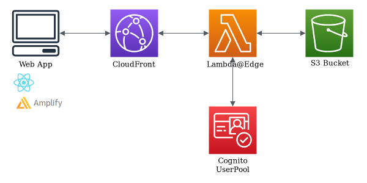

# Cognito@Edge

*Cognito authentication made easy to protect your website with CloudFront and Lambda@Edge.*

This Node.js package helps you verify that users making requests to a CloudFront distribution are authenticated using a Cognito user pool. It achieves that by looking at the cookies included in the request and, if the requester is not authenticated, it will redirect then to the user pool's login page.



### Alternatives

This package allows you to easily parse and verify Cognito cookies in a Lambda@Edge function. If you want full control over the configuration of AWS resources (CloudFront, Cognito, Lambda@Edge...), this is the solution for you.

If you want to try it out easily or to quickstart a new project, we recommend having a look at the [cognito-at-edge-federated-ui-sample](https://github.com/aws-samples/cognito-at-edge-federated-ui-sample) repository. It allows you to configure and deploy a sample application which uses Cognito@Edge in a few CLI commands.

If you need more configuration options (e.g. bring your own user pool or CloudFront distribution), you may want to use [this Serverless Application Repository application](https://console.aws.amazon.com/lambda/home?region=us-east-1#/create/app?applicationId=arn:aws:serverlessrepo:us-east-1:520945424137:applications/cloudfront-authorization-at-edge) ([GitHub](https://github.com/aws-samples/cloudfront-authorization-at-edge)) which provides a complete Auth@Edge solution. It does not use Cognito@Edge, but provides similar functionality.

## Getting started

### How To Install

The preferred way to install the AWS cognito-at-edge for Node.js is to use the [npm](http://npmjs.org/) package manager for Node.js. Simply type the following into a terminal window:

``` shell
npm install cognito-at-edge
```

### Usage

To use the package, you must create a [Lambda@Edge function](https://docs.aws.amazon.com/AmazonCloudFront/latest/DeveloperGuide/lambda-at-the-edge.html) and associate it with the CloudFront distribution's *viewer request* events.

Within your Lambda@Edge function, you can import and use the `Authenticator` class as shown here:

``` js
const { Authenticator } = require('cognito-at-edge');

const authenticator = new Authenticator({
  // Replace these parameter values with those of your own environment
  region: 'us-east-1', // user pool region
  userPoolId: 'us-east-1_tyo1a1FHH', // user pool ID
  userPoolAppId: '63gcbm2jmskokurt5ku9fhejc6', // user pool app client ID
  userPoolDomain: 'domain.auth.us-east-1.amazoncognito.com', // user pool domain
});

exports.handler = async (request) => authenticator.handle(request);
```

For an explanation of the interactions between CloudFront, Cognito and Lambda@Edge, we recommend reading this [AWS blog article](https://aws.amazon.com/blogs/networking-and-content-delivery/authorizationedge-how-to-use-lambdaedge-and-json-web-tokens-to-enhance-web-application-security/) which describe the required architecture to authenticate requests in CloudFront with Cognito.

## Reference - Authenticator Class

### Authenticator(params)

* `params` *Object* Authenticator parameters:
  * `region` *string* Cognito UserPool region (eg: `us-east-1`)
  * `userPoolId` *string* Cognito UserPool ID (eg: `us-east-1_tyo1a1FHH`)
  * `userPoolAppId` *string* Cognito UserPool Application ID (eg: `63gcbm2jmskokurt5ku9fhejc6`)
  * `userPoolAppSecret` *string* (Optional) Cognito UserPool Application Secret (eg: `oh470px2i0uvy4i2ha6sju0vxe4ata9ol3m63ufhs2t8yytwjn7p`)
  * `userPoolDomain` *string* Cognito UserPool domain (eg: `your-domain.auth.us-east-1.amazoncognito.com`)
  * `cookieExpirationDays` *number* (Optional) Number of day to set cookies expiration date, default to 365 days (eg: `365`)
  * `disableCookieDomain` *boolean* (Optional) Sets domain attribute in cookies, defaults to false (eg: `false`)
  * `logLevel` *string* (Optional) Logging level. Default: `'silent'`. One of `'fatal'`, `'error'`, `'warn'`, `'info'`, `'debug'`, `'trace'` or `'silent'`.

*This is the class constructor.*

### handle(request)

* `request` *Object* Lambda@Edge request object
  * See AWS doc for details: [Lambda@Edge events](https://docs.aws.amazon.com/AmazonCloudFront/latest/DeveloperGuide/lambda-event-structure.html)

Use it as your Lambda Handler. It will authenticate each query.

```
const authenticator = new Authenticator( ... );
exports.handler = async (request) => authenticator.handle(request);
```

### Getting Help

The best way to interact with our team is through GitHub.  You can [open an issue](https://github.com/awslabs/cognito-at-edge/issues/new/choose) 
and choose from one of our templates for [bug reports](https://github.com/awslabs/cognito-at-edge/issues/new?assignees=&labels=bug%2C+needs-triage&template=---bug-report.md&title=), 
[feature requests](https://github.com/awslabs/cognito-at-edge/issues/new?assignees=&labels=feature-request&template=---feature-request.md&title=) or 
[question](https://github.com/awslabs/cognito-at-edge/issues/new?assignees=&labels=question%2C+needs-triage&template=---questions---help.md&title=).  

## Contributing

We welcome community contributions and pull requests. See [CONTRIBUTING.md](https://github.com/awslabs/cognito-at-edge/blob/main/CONTRIBUTING.md) for information on how to set up a development environment and submit code.

### License

This project is licensed under the [Apache License, Version 2.0](https://www.apache.org/licenses/LICENSE-2.0.html), see LICENSE.txt and NOTICE.txt for more information.
